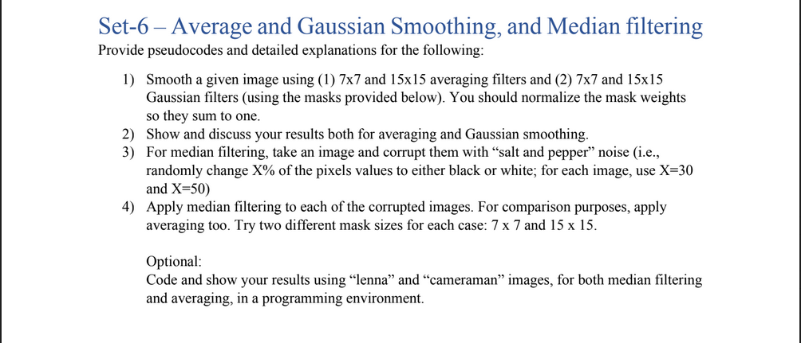
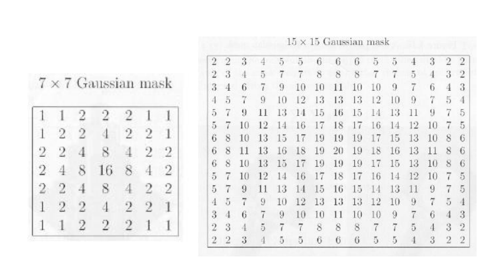

# Digital Image Processing Assignment for Mid Semester Examination:
We, a group of three students, namely, [Anjali](https://github.com/anjalimohapatra/), [Prachi](https://github.com/PrachiPallavi123) and [Rahul](https://github.com/hinduBale/) were assigned the following questions to be solved as a part of an evaluation scheme for Mid Semester examination of our DIP class in our 7th semester:

 
 
Along with the following attachment:
.
 
 
# Detailed Project Report:
A detailed report of this assignment along with pseudo-codes can be found [here](https://docs.google.com/document/d/1LxMPuAPSdtOswv-0wjKD8xmVpPzhu0P1gGu5sS8PD0o/edit?usp=sharing).
